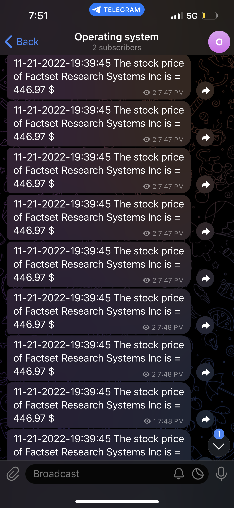

# StockScraping :
This Bash script scrape the price of a share on the site by URL.

Once the script is launched we will receive every minute the price of the $FDS share on telegram.

# Config :

Clone:
```
git clone URL
```
Enable script execution :
```
chmod u+x Operating_sysystem_Project.sh
```
Run Operating_sysystem_Project.sh :
```
./Operating_sysystem_Project.sh
```

# Telegram :
Set Up a bot on Telegram :
- search @BotFather and config your bot.
- Create a public group and add the bot.
- Request the API :https://api.telegram.org/bot/getUpdates And get your chat_id.
- Edit $ID_TELEGRAM and $TOKEN with your values.

# Exemple : 



# Exemple Logs : 

